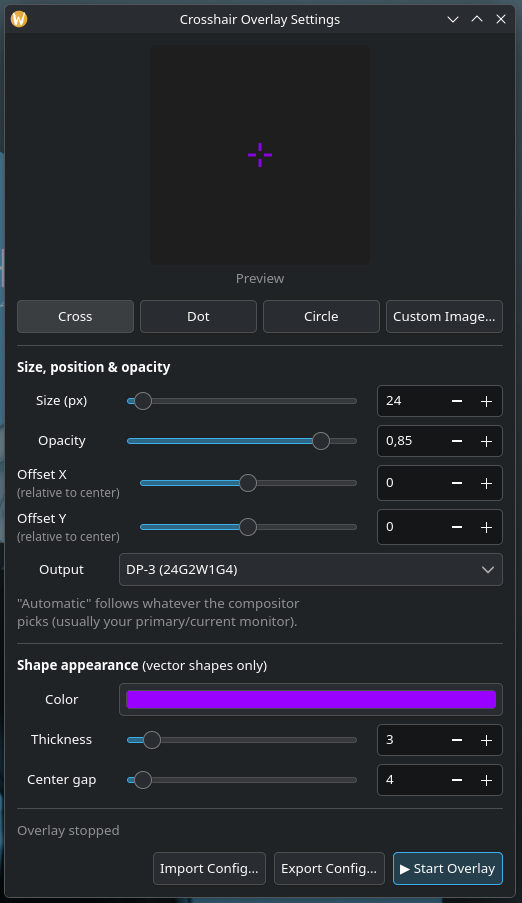
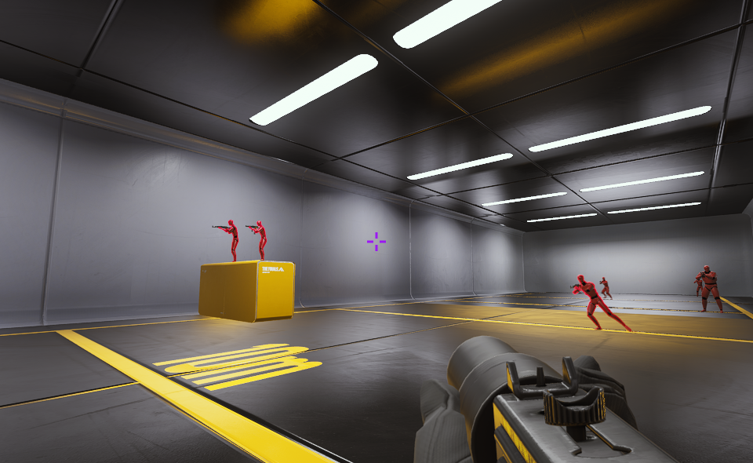

# crosshair-overlay
A crosshair overlay for Wayland that actually works properly: it's a real
layer-shell surface, it's click-through,
it never steals keyboard focus, and it comes with a GUI so you don't have to
hand-edit a config file to change the color or size.
Built and tested on KDE Plasma (Wayland) and Hyprland. Should work on any
compositor that supports `wlr-layer-shell`.

<p>
  
</p>
<p>
  
</p>

## Why this exists
Most of the crosshair overlays floating around for Linux are either
X11 hacks that don't really work right under Wayland, or they work but leave
you editing a TOML file by hand every time you want to nudge the size or
change the color. This one has a proper settings window with a live preview,
and it's been tested rather than just written and forgotten.
## Features
- Cross, dot, or circle shapes, or use your own custom image instead
- Live-adjustable size, thickness, center gap, color, and opacity
- Position offset and per-output targeting (pick which monitor it shows up on)
- Settings GUI with a live preview
- Import/export your config as a single portable `.toml` file that embeds
  custom images right into it, so it's one file to share
- Controlled via a tiny CLI (`crosshairctl toggle/show/hide/reload/quit`)
  so you can bind it to a keyboard shortcut in your desktop environment
## Known issues
- The settings GUI opens at a fixed size and isn't currently built to shrink
  below that. On a monitor with less than 1080p of vertical resolution, or in
  any environment where you can't easily drag the window around, part of the
  window can end up off-screen with no way to reach the bottom buttons. If you
  hit this, try a lower UI scale factor, or move the window with a keyboard
  shortcut if your desktop supports one (e.g. KDE's default Meta+drag-anywhere-in-window).
  You can also just use crosshairctl by itself.
  
## Installing
### Arch Linux (AUR)
```bash
yay -S crosshair-overlay
```
### Arch Linux (Manually)
```bash
git clone https://aur.archlinux.org/crosshair-overlay.git
cd crosshair-overlay
makepkg -si
```
### Anything else
There's no distro-agnostic package yet (an AppImage may show up later). You'll
need Python 3.11+, GTK4, `gtk4-layer-shell`, PyGObject, and pycairo installed.
Then:
```bash
git clone https://github.com/m39d/crosshair-overlay.git
cd crosshair-overlay
mkdir -p ~/.local/bin
cp *.py ~/.local/bin/
chmod +x ~/.local/bin/crosshaird.py ~/.local/bin/crosshair-gui.py ~/.local/bin/crosshairctl.py
```
Make sure `~/.local/bin` is on your `PATH`, then run `crosshair-gui.py`.
## Using it
Launch the settings GUI:
```bash
crosshair-gui
```
Opening it will automatically start the overlay if it isn't running
already. Change anything in the window and it updates live. There's an
Import/Export pair of buttons if you want to save a specific look and
share it or move it to another machine.
To control the overlay without opening the GUI (handy for a keyboard
shortcut, since Wayland compositors won't let apps register their own
global hotkeys):
```bash
crosshairctl toggle   # show/hide
crosshairctl show
crosshairctl hide
crosshairctl reload    # re-read config.toml and apply changes
crosshairctl quit
```
**KDE Plasma:** System Settings → Shortcuts → Custom Shortcuts → add a new
one that runs `crosshairctl toggle`.
**Other compositors:** bind it however you'd normally bind a command to a
key (e.g. in your Hyprland config: `bind = $mainMod, X, exec, crosshairctl toggle`).
## Config file
Lives at `~/.config/crosshair-overlay/config.toml`. You generally shouldn't
need to touch this by hand as the GUI writes it for you, but here's what's
in it if you're curious or want to script something. A fully commented
example, `config.example.toml`, is included in the repo if you'd rather set
things up by hand before ever opening the GUI:
```toml
[crosshair]
shape = "cross"      # cross | dot | circle - ignored if `image` is set
size = 24
thickness = 2
gap = 4
color = "#00FF00"
opacity = 0.85
output = ""           # blank = compositor default output
offset_x = 0
offset_y = 0
# image = "~/.config/crosshair-overlay/crosshair.png"
[daemon]
start_visible = true
```
## License
MIT. See [LICENSE](LICENSE).
