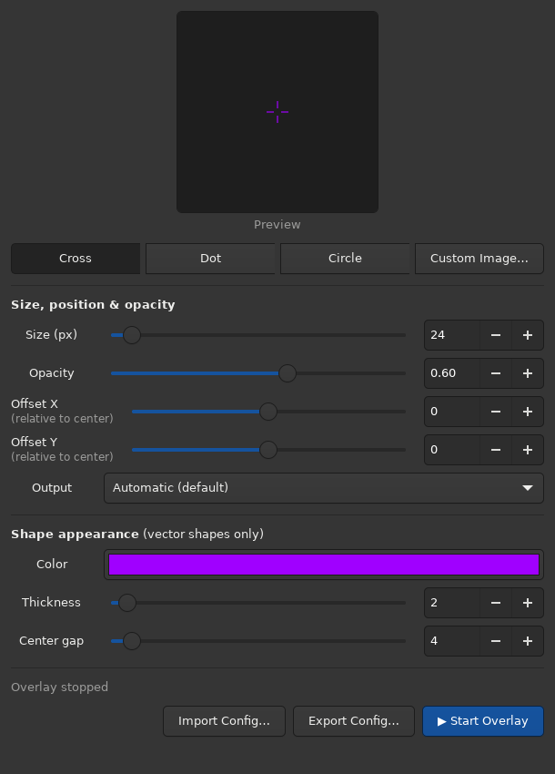
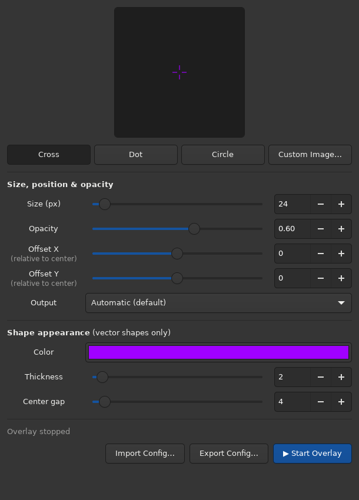

# Settings polish and reliability review

This branch refines the existing tool. It does not publish a release or change the AUR package version.

## Visual changes

| Before | After |
| --- | --- |
|  |  |

Screenshots are from the actual GTK window under Adwaita Dark on a virtual X11 display. KDE/Breeze will retain its own theme and window decorations.

- Center labels and offset captions in one shared-width column; align the sliders across sections.
- Remove the redundant Preview caption while retaining a tooltip and accessible label.
- Keep separate shape buttons consistently rounded.
- Fit crosshairs larger than the preview canvas instead of clipping them; smaller crosshairs stay at their actual logical size.
- Disable Center gap for dot, circle, and image modes, where it has no effect.
- Wrap status messages and name controls for assistive technology.

## Behavior fixes

- Flush a pending slider edit when closing the settings window and remove window-owned timers.
- Save current settings before starting the daemon, forward custom `--config` / `--socket`, prevent repeated Start clicks during startup, and report a failed start.
- Probe the socket listener instead of treating a leftover socket file as a running overlay.
- Keep the selected shape selected; clicking Custom Image again opens the replacement picker and Cancel retains the previous selection.
- Validate imported configuration and images before replacing current settings. Failed image embedding stops export rather than producing an incomplete portable file.
- Write configuration atomically so concurrent reloads cannot read a truncated file. Preserve Unicode image filenames, including emoji, in TOML.
- Reject zero/negative recorded monitor resolutions instead of dividing by zero when scaling offsets.
- Clamp drawn cross arms at the available size when the center gap is too large; previously the line segments reversed direction.
- Reuse the daemon's CSS provider across reloads and put a timeout on idle control connections.

Config validation now enforces the existing GUI ranges: size 4–300, thickness 1–20, gap 0–60, and opacity 0–1. Malformed imports are rejected. Invalid on-disk configuration falls back to defaults with a terminal warning. This is a behavior change for hand-edited values outside those ranges.

## Validation

19 regression tests pass, using real GTK widgets, Cairo rendering, temporary config files, portable image bundles, and Unix sockets. The socket-server test isolates the server class without running the daemon's Wayland startup/re-exec. Python compilation and `git diff --check` pass. The settings window was visually inspected at normal and reduced height.

Run the same tests on a Linux machine with Python 3.11+, PyGObject, pycairo, GTK4, and Xvfb:

```sh
xvfb-run -a env GDK_BACKEND=x11 GSK_RENDERER=cairo GTK_A11Y=none /usr/bin/python3 -m unittest discover -s tests -v
```

The GitHub Actions workflow runs this suite for pushes and pull requests.

## Before merging

The actual layer-shell overlay still needs a smoke test on KDE Wayland or Hyprland; the virtual display cannot establish fullscreen stacking, focus/click-through behavior, or multi-monitor placement.

1. Stop the installed overlay, then run `python3 crosshair-gui.py` from this checkout.
2. Check label spacing in your desktop theme, change each shape, replace/cancel a custom image, and export/import it.
3. Change a slider and immediately close settings; reopen and verify the change survived.
4. Start/stop, use the CLI toggle, and verify the overlay stays click-through over a fullscreen game.
5. Check centered and nonzero offsets on the intended monitor, including after a size change.

The existing Automatic-output geometry guess and raw-offset format remain unchanged. For reliable nonzero offsets across differently sized monitors, select the intended output explicitly.

See [the native Wayland smoke-test checklist](wayland-smoke-test.md) for
prerequisites, isolated launch commands, per-compositor results, and concrete
pass criteria. Desktop results remain NOT RUN until recorded on a real session.
